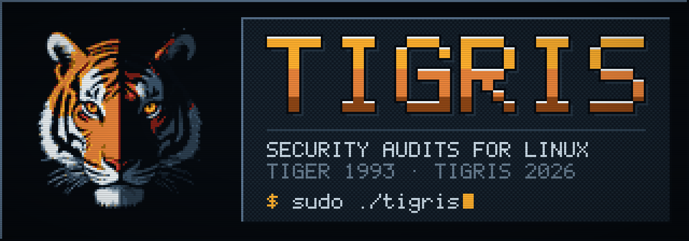

<p align="center">
  
</p>

<p align="center">
  <b>A security auditor for Linux, in plain POSIX shell.</b><br>
  TIGER's thirty years of checks, rebuilt for how Linux is run today.
</p>

<p align="center">
  <a href="https://github.com/creativeheadz/tigris/actions/workflows/ci.yml"></a>
  <a href="https://github.com/creativeheadz/tigris/releases/latest"></a>
  <a href="COPYING"></a>
  
  <br>
  
  
  
  
</p>

<p align="center">
  <a href="#quick-start">Quick start</a> ·
  <a href="#what-it-checks">What it checks</a> ·
  <a href="#audit-a-system-that-is-not-running">Offline audit</a> ·
  <a href="#compliance-mapping">Compliance</a> ·
  <a href="#reports-drift-and-exit-status">Reports and drift</a> ·
  <a href="#install">Install</a> ·
  <a href="ROADMAP.md">Roadmap</a>
</p>

---

## Why Tigris

<table>
<tr>
<td width="50%" valign="top">

**Nothing to install.** Clone it and run it, or install the package:
shell and awk, no compiler, no interpreter, no agent, no network. It runs under mawk, gawk
and busybox awk, and stays light enough for a Raspberry Pi.

</td>
<td width="50%" valign="top">

**Reads the system as it is.** Installed files are checked against
dpkg, rpm, apk and pacman. The firewall is read from the kernel's own
ruleset, whatever wrote it. sshd is asked for its effective
configuration.

</td>
</tr>
<tr>
<td valign="top">

**Says what it did not check.** A check that cannot run properly, for
lack of root or on an offline image, is skipped and listed with the
reason, never guessed at. The exit status is the worst finding.

</td>
<td valign="top">

**Drift, not noise.** `tigris -q --since last` prints only what changed
since the last run, so a nightly cron mails only when there is news.
Findings you accept stay accepted, with a reason and an expiry date.

</td>
</tr>
<tr>
<td valign="top">

**Audits images without booting them.** `tigris --root /mnt/image`
reads a mounted disk, an unpacked container image or a VM snapshot.
Nothing in the image is ever run.

</td>
<td valign="top">

**A contract for machines.** Every run also writes JSON Lines with a
versioned schema, a category and the compliance controls per finding,
and `tigris explain ID` says what any of the 434 finding ids means and
how to fix it.

</td>
</tr>
</table>

## Quick start

```sh
git clone https://github.com/creativeheadz/tigris.git
cd tigris
sudo ./tigris                     # the full audit, about two minutes
sudo ./tigris --profile quick     # everything but the filesystem scan, about one
./tigris explain upd003f          # what a finding means and how to fix it
```

The report lands in `log/`, as text and as JSON Lines. Run without root,
Tigris skips the checks that need it and lists them. It will not run check
scripts owned by anyone but the user running it, with one exception: a
tree owned by the person who ran `sudo` is theirs to run. A copy that cron
runs, or an installed one, must belong to root. `./tiger` still works and
does the same as `./tigris`.

### What a report looks like

From an offline audit of a Debian 12 container image (abridged):

```text
# Checking security updates (apt)...
--FAIL-- [upd003f] 7 security updates are waiting to be installed (apt).
         libgcrypt20, libgnutls30, liblzma5, libpcre2-8-0, libtasn1-6,
         perl-base, tzdata. The package lists were last updated today. Install
         them with 'apt-get upgrade'.
--WARN-- [upd002w] Security updates are not installed automatically: each
         waits until someone installs it.
# Checking PAM's password quality and lockout...
--WARN-- [pam003w] Accounts are not locked after repeated failed logins: no
         pam_faillock or pam_tally2 in an auth stack, so passwords can be
         guessed for as long as it takes.
```

```text
$ ./tigris explain upd003f
Severity: FAIL
Category: packages
Check: check_updates

Security updates are available and not installed: the packages named
in the detail have known holes that their new versions close, and the
holes are public. ...
```

## What it checks

Every finding id has an explanation in [`meta/`](meta), a severity and one
of fifteen categories, which the JSON carries. `make` builds them all into
`doc/explanations.html`.

| Category | Ids | What is looked at |
|---|---:|---|
| **filesystem** | 76 | Setuid and setgid files against what the packages ship, world-writable files and directories, devices, files nobody owns, `/tmp` and `/dev/shm` mount options, disk encryption, swap, core dumps, umask |
| **accounts** | 69 | Password and shadow files, root's account, groups, sudo's rules (NOPASSWD, wildcards, `!authenticate`), PAM's password quality and lockout, every account's PATH, login shells, accounts that never logged in |
| **services** | 68 | What enabled systemd services and timers run, their unit files and sandboxing, time synchronisation, inetd, sendmail, Apache, nginx and its TLS, MySQL and MariaDB, PostgreSQL, Redis, certificates about to expire |
| **network** | 42 | What listens on which port, IPv4 and IPv6, and as whom; network sysctls; NFS exports; NTP; DNS resolvers (`resolv.conf`, unbound, BIND); sendmail's configuration |
| **tigris** | 33 | Tigris's own configuration and the run itself |
| **intrusion** | 21 | Rootkit traces, processes running deleted binaries, `.exrc` files, places intruders are known to use |
| **kernel** | 19 | Hardening sysctls, AppArmor or SELinux enforcing, kernel lockdown |
| **packages** | 18 | Installed files against dpkg, rpm, apk and pacman; security updates waiting and whether they install themselves; dpkg's mode overrides |
| **ssh** | 18 | sshd's effective configuration: root login, passwords, empty passwords, X11, PAM, weak ciphers, MACs and key exchange |
| **logging** | 15 | Log files, auditd running with rules, logs kept across reboots, remote logging (rsyslog, syslog-ng, journal upload) |
| **boot** | 14 | Secure Boot (off, in setup mode, on), lockdown, single-user mode, the boot loader's password |
| **cron** | 14 | `/etc/crontab`, `cron.d`, the `cron.daily` and other scripts, and users' crontabs: who can write them, whose they are, and what the jobs they hold run |
| **integrity** | 11 | Signatures of system binaries, and AIDE, Tripwire or integrit when installed |
| **containers** | 10 | Who can use the Docker or Podman socket, the Docker API on TCP without TLS, privileged containers, host namespaces, the host's `/` mounted in one |
| **firewall** | 6 | Incoming traffic denied unless something accepts it, IPv4 and IPv6, read from the kernel's ruleset (nft, iptables, ufw, firewalld), and the ports Docker publishes past it |

### Profiles

A profile is a short file in [`profiles/`](profiles), read on top of
`tigerrc`: `sudo ./tigris --profile NAME`.

| Profile | For |
|---|---|
| `quick` | Everything except the filesystem scan: about a minute where the full run takes two |
| `server` | A server: USB storage is expected to be off, and every account's PATH and the processes using deleted files are checked too |
| `desktop` | A desktop: without the checks for what only servers run |
| `container` | An image or a container: without the host's kernel, boot, firewall, systemd and disks |

Your own profiles go in a `profiles/` directory beside your `tigerrc`.

## Audit a system that is not running

```sh
sudo ./tigris --root /mnt/image
```

Or from the container image, which carries every distribution's package
tools (dpkg and apt, rpm, dnf, zypper, pacman, apk), so one image audits
any Linux root:

```sh
docker build -t tigris .
docker run --rm -v /path/to/rootfs:/target:ro -v "$PWD/reports:/opt/tigris/log" \
  tigris --root /target
```

To audit a container image without running it, export it first
(`docker export $(docker create IMAGE) | tar -C rootfs -xf -`).

A disk mounted from another machine, a container image unpacked into a
directory, a VM snapshot: Tigris reads its files under that directory and
follows its symbolic links inside it, so an absolute link in the image
never leads to this machine's files, and file owners are named by the
image's own passwd and group files, not this machine's. This machine's
dpkg, apt, rpm, dnf, zypper, apk or pacman are pointed at the image's
package databases. Nothing in the image is run.

| Reads an offline root | Skipped there, with the reason |
|---|---|
| Everything that is on disk: the file system scan (setuid and setgid files against what its packages ship, world-writable directories, files whose owner its own passwd does not know, devices outside /dev, dangling links, odd names), the permissions of its system files, devices and log files, accounts and passwords (the root's passwd, shadow and group files, homes, dot files, every account's PATH, root's access, accounts that never logged in), umask in login.defs and the shells' start-up files, cron, systemd units, the boot loader and single-user mode, the kernel and network settings it applies at boot (its sysctl.d, layered as systemd-sysctl layers it), mount options and encryption from its fstab and crypttab, core dumps, USB storage, package integrity (dpkg, rpm, apk, pacman), security updates waiting, PAM, sshd's configuration (worked out from its files, as sshd would), sudo's rules, dpkg's mode overrides, services and mail aliases, NFS exports, the release, the places intruders use, the paths embedded in its binaries, nginx, databases, DNS, logging and certificates | What needs the running system, skipped saying so: processes and listening ports, the firewall, Secure Boot and the CPU's flaws, AppArmor or SELinux, auditd, time daemons, rootkit traces in the running binaries, containers |

On Debian, Ubuntu, Fedora, Rocky, openSUSE, Alpine and Arch the package
checks report the same of a copy of a system as of the system itself, and
CI checks that they go on doing so; the sshd and sudo checks were compared
against the live system the same way. Tigris writes nothing into the
root, but the package tools may write their logs and caches there as they
would on that system: mount it read-only if it must stay unchanged.

## Compliance mapping

Every finding maps to the controls it is evidence about in four
frameworks, free and in the open: CIS Controls v8 safeguards, NIST SP
800-53 Rev. 5, ISO/IEC 27001:2022 Annex A and UK Cyber Essentials. The
map is one reviewable file, [doc/controls.map](doc/controls.map), by
check, with overrides by finding id; `tigris explain ID` shows a
finding's controls and the JSON carries them:

```json
{"type":"finding","level":"WARN","id":"root001w","check":"check_root","message":"Remote root login allowed in /etc/securetty","category":"accounts","controls":{"cis_v8":["5.4"],"nist_800_53":["AC-6","AC-17"],"iso_27001_2022":["8.2","8.5"],"cyber_essentials":["User access control"]}}
```

A finding is evidence for an assessment, not a verdict on a control:
most controls ask for things no tool on one host can see.

Every finding that can show a gap is mapped, or declared unmapped on
purpose with a reason in the map, and `tests/explain_check.sh` fails the
build when one is neither, so a new finding cannot slip past the mapping.

## Reports, drift and exit status

Every run writes `log/security.report.HOST.DATE` and, beside it, the same
findings as JSON Lines: a `run` record, one `finding` per message with its
`level`, `id`, `check`, `category`, `message` and `detail`, `skip` records
for what did not run, and a `summary`. The format is a documented contract
with a version field and a JSON Schema:
[doc/json-format.md](doc/json-format.md).

```json
{"type":"finding","level":"FAIL","id":"upd003f","check":"check_updates","message":"7 security updates are waiting to be installed (apt).","detail":"libgcrypt20, libgnutls30, ...","category":"packages"}
```

**Drift.** `tigris-diff` compares two runs and lists what is new and what
was resolved (with no arguments, the last two in `log/`; `-j` for JSON).
`tigris` does it itself with `--since`, and with `-q` prints nothing when
nothing changed:

```sh
sudo ./tigris -q --since last        # nightly cron: mail only when there is news
./tigris-diff old.jsonl new.jsonl    # any two runs
```

**Accepting a finding.** A finding you have looked at and decided to live
with stays out of the text report, and in the JSON marked `accepted`, until
its date passes:

```sh
./tigris-accept lin015w -r "Docker needs IP forwarding"
./tigris-accept sysd001w -m "docker.service*" -r "sandboxing tracked in #12" -u 2027-01-31
./tigris-accept -l
```

**Exit status.** The worst finding of the run (with `--since`, the worst
new one), for CI and monitoring:

| Status | Meaning |
|:---:|---|
| 0 | Nothing at WARN or above |
| 1 | The audit did not run |
| 2 | A check could not run (an ERROR, or a check skipped for lack of root) |
| 3 | WARN |
| 4 | FAIL |
| 5 | ALERT |

## Install

Every release comes with packages, built and tested in CI, that install
as `tigris` beside a distribution's own `tiger` without sharing a file
with it: `tigris` on the path, the library in `/usr/lib/tigris`, the
configuration in `/etc/tigris`, reports in `/var/log/tigris`.

```sh
sudo dnf copr enable creativeheadz/tigris && sudo dnf install tigris   # Fedora 43 and 44, EPEL 9 and 10
sudo apt install ./tigris_*.deb                # Debian, Ubuntu: the .deb from the release page
sudo dnf install ./tigris-*.rpm                # Fedora: the .rpm from the release page
sudo apk add --allow-untrusted tigris-*.apk    # Alpine: the .apk from the release page
```

An AUR `PKGBUILD` is in [`packaging/`](packaging); it goes on the AUR
as soon as the AUR registers new accounts again.

From a checkout, Tigris needs no compiler. If you have one,
`make && make -C c install` builds a few small C helpers into `bin/`,
which Tigris then prefers to its shell equivalents. To install
system-wide from source:

```sh
./configure
make install
man tigris
```

Or as a container: `docker build -t tigris .` builds an image with
Tigris and every distribution's package tools, for auditing roots
offline (above). Release tags publish it as `ghcr.io/creativeheadz/tigris`.

Tested in CI on Debian stable and sid, Ubuntu 24.04, Fedora, Rocky Linux 9,
openSUSE Tumbleweed, Alpine and Arch, under mawk, gawk and busybox awk.
On Debian and Ubuntu, `apt install tiger` gives the original TIGER from the
archive, not this fork.

## Where it is going

[ROADMAP.md](ROADMAP.md) has the decisions, the status and what is next.
3.7.0 finished the offline audit, so an image reads as fully as a
running system, and brought the packages; 3.6.0 the compliance mapping,
the transparent summary and five server-side checks; 3.5.0 the offline
audit. 3.8.0 carries the same audit to macOS and FreeBSD, from fixture
roots on any machine. Next is 4.0: the internals renamed in one go (`tigris.conf`,
`Tigris_*`, `/etc/tigris`) with shims for old configurations, a `Fix`
line in every finding's metadata, and later a PowerShell engine for
Windows against the same contract. Every change is measured for wall
time, CPU and memory.

## Lineage

Tigris descends from **TIGER**, written at Texas A&M University in 1993 by
Douglas Lee Schales, David K. Hess and David R. Safford, and maintained on
GNU Savannah from 2001 to 2019 by Javier Fernández-Sanguino Peña. Tigris is
an independent fork of that code, started in October 2026 from the
Savannah history and maintained by Andrei Trimbitas. The official TIGER
remains at <https://savannah.nongnu.org/projects/tiger/>; fixes made here
that apply to it are offered back there and to the Debian bug tracker.

The name is the Latin for tiger, and the root of the Icelandic
*tígrisdýr*; there was never a Norse word for an animal no Norseman saw.

The 3.2.4 release here finished the release candidate TIGER left in 2018;
3.3.0 was the first release as Tigris. See [CHANGES](CHANGES). TIGER's
configurations for AIX, HP-UX, IRIX, NeXT, SunOS, Tru64, UNICOS and Mac OS X
were retired after that release; they are in the git history under the tag
`attic/other-unix-2026-10`. [AUTHORS](AUTHORS) and [CREDITS](CREDITS) list
everyone who built TIGER. The original [README](README) and [USING](USING)
still describe the internals accurately.

Solaris 11.4 is being worked (see [doc/solaris-strategy.md](doc/solaris-strategy.md)):
it still runs real estates, and Solaris for x86 virtualizes, so its
checks grow against fixtures and a local QEMU VM. AIX is the harder
case: actively maintained on POWER, but it needs POWER hardware or
cloud time that no free CI runner offers, and nobody here runs it.
If you run AIX and can lend a machine or maintain its checks, that
unlocks the rest of Phase D (see [ROADMAP.md](ROADMAP.md)); until
then its groups stay explicitly uncovered rather than silently
missing.

<p align="center">
  
</p>

The tiger keeps the idea of TIGER's 2002 logo, a face half in light and
half in shadow with one eye watching, redrawn the way the Kestrel's
pictures are made: rendered by FLUX.2 klein, then crushed to a 96-pixel
grid and a 27-colour palette. How it was made, and how to make it again,
is in [art/README.md](art/README.md).

## Licence

GNU General Public License, version 2 or later; see [COPYING](COPYING).
`c/md5.c` (RSA Data Security) and `c/snefru.c` (Xerox) carry their own
notices.
