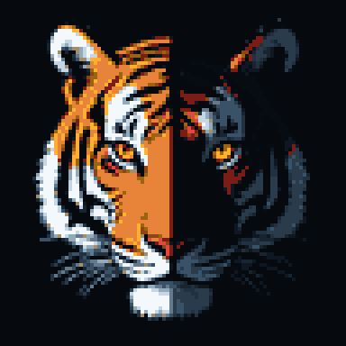
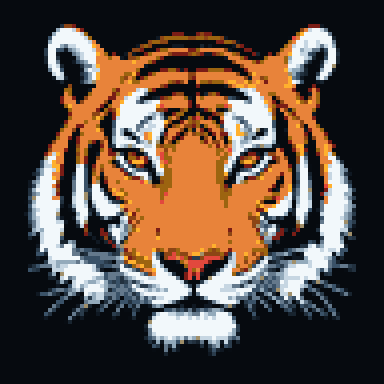

# The tiger

<p align="center">
  
  &nbsp;&nbsp;
  
</p>

TIGER's logo, chosen in a contest in 2002 ([README.logo](../README.logo)),
was a tiger's face half in light and half in shadow, one eye watching.
Tigris keeps the idea and redraws it the way the pictures aboard the
Kestrel are made: an image model renders it large, and everything that
makes it look like 1993 happens afterwards.

## How it is made

1. **Rendered** by FLUX.2 klein (`black-forest-labs/FLUX.2-klein-4B`) on an
   RTX 4070: 512 by 512, 4 steps, guidance 1.0, a fixed seed.
   [`render.py`](render.py) holds the prompts and seeds; the renders are
   in [`source/`](source). The prompt asks for flat shapes and strong
   outlines, because those survive the next step and a photograph does
   not: at 96 pixels fur turns to camouflage.
2. **Crushed** by [`mkart.py`](mkart.py): to 96 pixels wide with LANCZOS,
   then to the nearest of 27 colours with no dithering. The colours are
   the Kestrel's SCREEN palette, a steel ramp and one hue per meaning, so
   the shadow side of the face falls into the steel and the lit side into
   amber, orange and the near-whites. Error diffusion against a palette
   that small scatters confetti over fur, so there is none.
3. **Shown at whole multiples** (4 here) and nothing in between: a 1.5x
   pixel is a blurred pixel.
4. **Lettered** in the Kestrel's typeface, KP, five by seven
   ([`kp.py`](kp.py)), with the banner's title banded amber, orange and
   burnt orange under a keyline and a drop shadow, on a bevelled panel
   dithered from two steps of the steel ramp, with a CRT's scanlines
   over the whole thing.

## Making it again

```sh
# on the machine with the card (Zeus)
python art/render.py art/source            # tiger-split.png, tiger-full.png
# anywhere with Pillow
python3 art/mkart.py                       # tiger.png, tiger-full.png, banner.png, social.png
```

| File | What it is |
|---|---|
| `banner.png` | The README's banner, 1280 by 448, animated: the cursor blinks and the eye in the shadow narrows now and then |
| `social.png` | 1280 by 640, for the repository's social preview (GitHub: Settings, General, Social preview) |
| `tiger.png`, `tiger-full.png` | The two tigers, 96 pixels at four times |
| `source/` | The renders, as FLUX drew them |

The palette and the typeface come from dyad, Andrei Trimbitas's Kestrel
project, and are used here by the same author.
